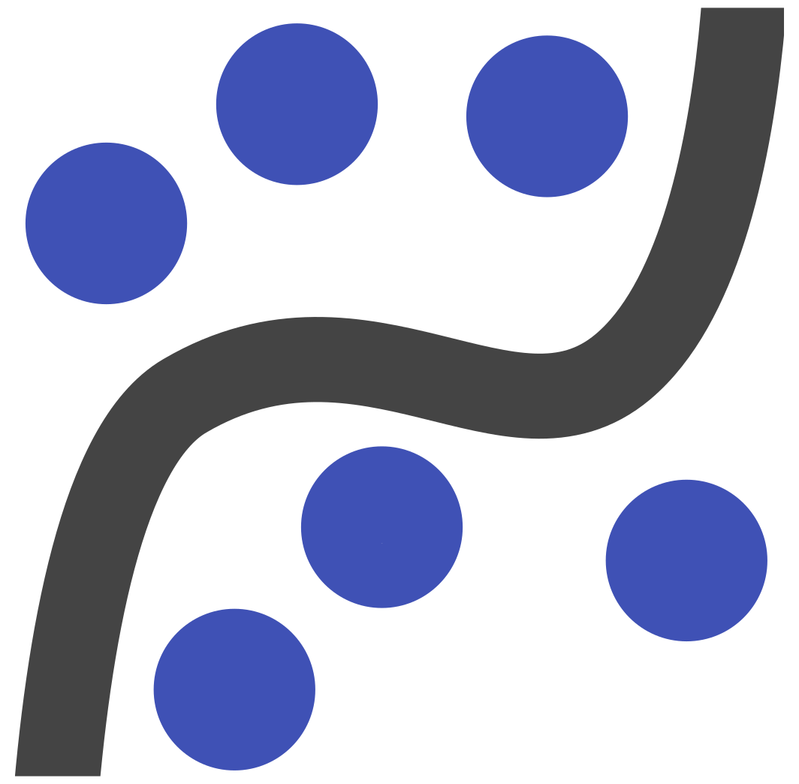

<h1 align="left">Aloha 👋, I'm Ricko 🍍~</h1>
<h3 align="left">A self-taught ✨Data Analyst✨. I have a passion for diving into the world of data, continuously learning and experimenting.</h3>

- 👨‍🏫 I have a little enough understanding of **Python, SQL, ELT Pipeline, and Statistics and Probability**
- 🌱 I'm currently trying to learn **C, QGIS, Linear Algebra and Calculus, and Machine Learning**
- 💡 I'm aspire to be a **Spatial Data Scientist**
- 📫 How to reach me: **rickojanuarh@gmail.com**
- 🌏 Bogor, Indonesia

<h3 align="left">Languages and Tools:</h3>

  
  
  
  
  
  
  
  
  
  
  
  
  
  
  
  
  
  

